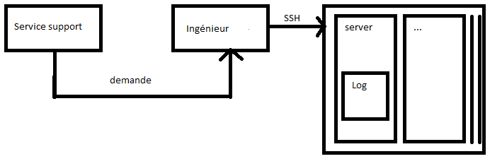
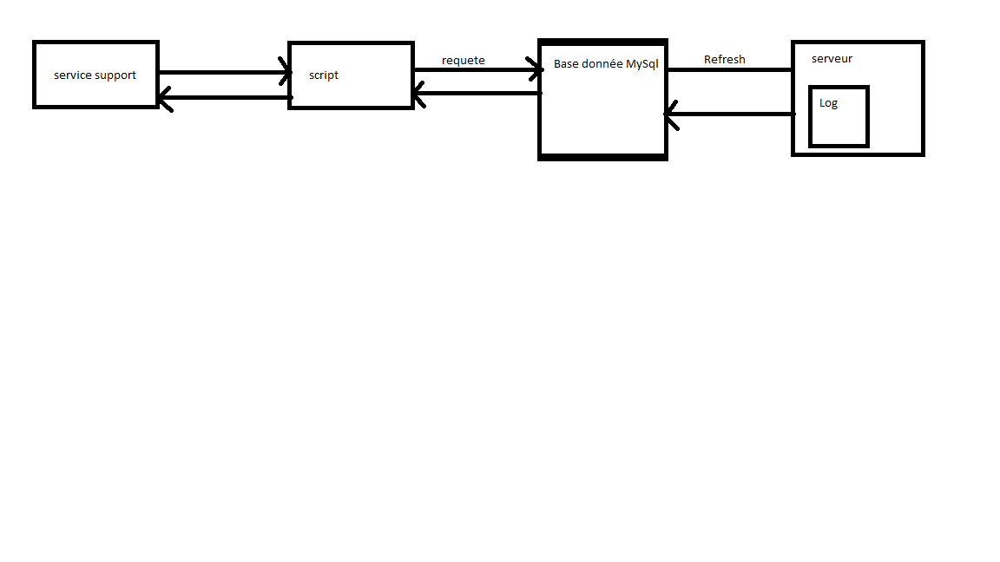
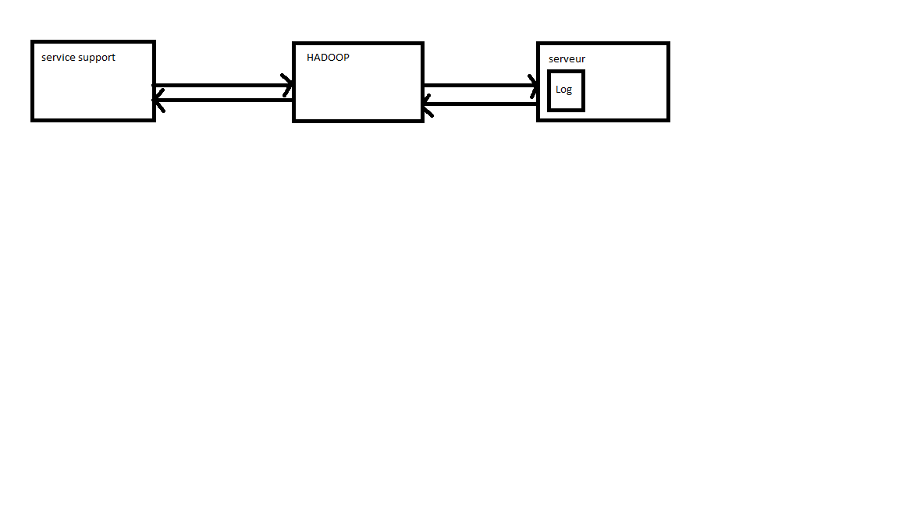

# adr-rackspace

VERSION 1 : Début / systeme de fichiers stoqués su chaques machines
======

* Contexte, la problématiques, les cas d’utilisation

-un contexte

Les logs sont stoqués sur chaques serveurs dans des fichiers textes et accédés à la main par les ingénieurs

-la problématiques

Après un certain nombre de cerveur, le travail devient fastidieux et consomme beaucoup de temps	

-cas d’utilisation

Un utilisateur n'a pas pu envoyer de mail et contact le service client. Ce dernier contact les ingénieurs, qui se connectent en ssh sur les serveurs afin de recuperer les informations.
	
* Scénarios d’attribut de qualité mis en avant

Il s'agit d'un systeme basic simple à mettre en place.

* Vues de structures architecturales pertinentes au regard des attributs choisis

VERSION 2 : Système MySql basé sur des bases de données relationnel
======

* Contexte, la problématiques, les cas d’utilisation 

-un contexte

Mise en place d'une solution MySql ou les logs sont intégré à une base de données relationnel, utilisable par le support technique sans l'aide des ingénieurs
Un Cron s'occupe de l'appel du script de rotation des logs.

-la problématiques

Les requetes sont (très) lentes à cause d'un bloquage au niveau des commandes "insert", plus tard amélioré grace à un systeme de "bulk loading".

-cas d’utilisation

Un utilisateur n'a pas pu envoyer de mail et contact le service client.
	
* Scénarios d’attribut de qualité mis en avant

Simplicité

* Vues de structures architecturales pertinentes au regard des attributs choisis

VERSION 3 : Solution Hadoop
======

* un contexte, la problématiques, les cas d’utilisation 

-un contexte

Utilisation d'HADOOP, afin de repartir les taches sur les serveurs dynamiquement. Permet d'eeffectuer des requetes rapidement efficacement et avec des stats.

-la problématiques

aucun a part les problèmes humains.

-cas d’utilisation

* Scénarios d’attribut de qualité mis en avant

performance, stabilité

* Vues de structures architecturales pertinentes au regard des attributs choisis

